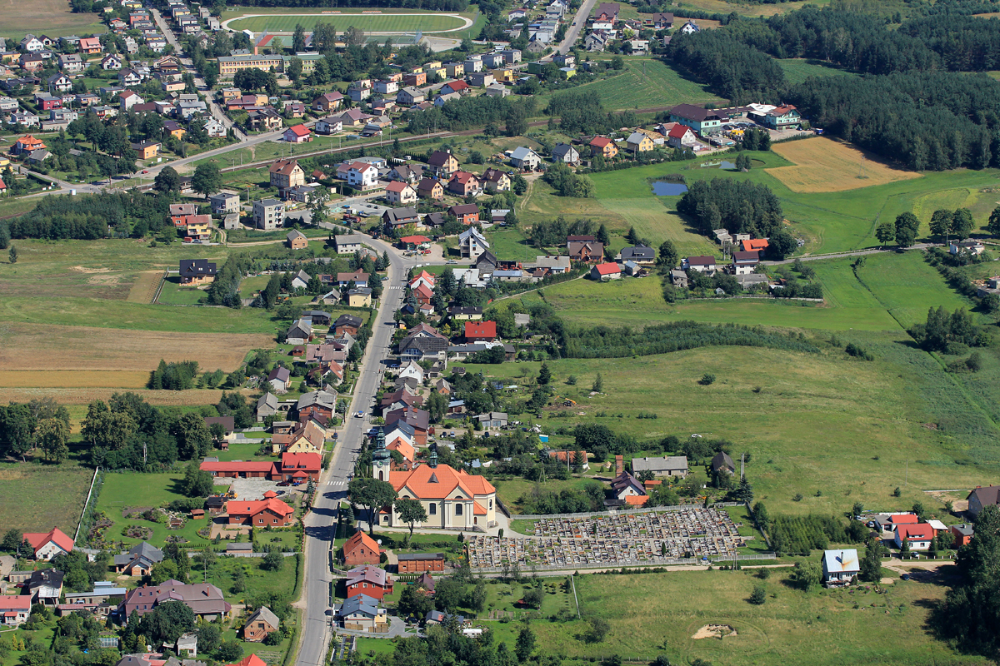
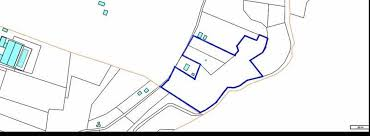

= _Pinczyn ;)_ 

http://pinczyn.pl/zalacznik/19943/4.jpg[pinczyn]

== Szkoła w Pinczynie:

* [x] <http://zkiwpinczyn.pl/>

* [x] <http://przedszkolepinczyn.pl>

* Historia szkoły

** SZKOŁA PODSTAWOWA
 im. Bohaterów Westerplatte
- dobre wyniki dydaktyczne
- aktywne metody nauczania
- wykwalifikowana kadra pedagogiczna
- atmosfera życzliwości i bezpieczeństwa
- różnorodne, nowatorskie metody nauczania

** GIMNAZJUM
 im. Ks. Stanisława Hoffmanna
- możliwość rozwoju zainteresowań
- grono doświadczonych nauczycieli
- serdeczna asmosfera wsród uczniów
- pozytywne środowisko wychowawcze
- dobre, bezpieczne i przyjazne warunki do nauki

** HISTORIA SZKOŁY W PINCZYNIE
 W roku szkolnym 1968/69, w dwóch budynkach, sześciu pomieszczeniach do nauczania uczyło się 12 oddziałów, a w szkole na jeden oddział przypadało 53 uczniów. Tak trudnych warunków szkoła nigdy nie posiadała, w związku z tym 10.X.1968r.rozpoczęto budowę nowej szkoły. Szkoła została oddana do użytku 22 lipca 1969r. Rok szkolny 1969/70 rozpoczął się w nowej szkole w 30 rocznicę wybuchu II wojny światowej. Tego dnia szkoła otrzymała sztandar i imię Bohaterów Westerplatte.

 W roku szkolnym 1999/2000 w wyniku wprowadzenia I etapu reformy oświaty powstało w Pinczynie Publiczne Gimnazjum, został powołany Zespół Kształcenia i Wychowania, w skład którego wchodzą: Publiczne Przedszkole w Pinczynie, Publiczna Szkoła Podstawowa w Pinczynie, Publiczne Gimnazjum w Pinczynie.

** Nazwa wsi:
 Nazwa wsi pochodzi od przezwiska Pinka lub od określenia pieniek, z gwarową wymową pinek. Najprawdopodobniej pierwotnie nazwa wsi brzmiała Pieńki, gwarowo Pinki i stopniowo zmieniała się w Pinczyn. Być może nazwa ma związek z nazwą rzeczki Piesienicy, od której miało powstać nazwisko Pyszyński. Mieszkańcy wywodzą nazwę wsi od połączenia dwóch zniekształconych słów: "piencz (pincz w znaczeniu pięć) synów".

 Pinczyn leży przy linii kolejowej nr 203 Tczew – Kostrzyn. Na łące (teren prywatny) obok toru kolejowego leży głaz narzutowy - pomnik przyrody przyniesiony niegdyś przez lodowiec, zwany Kamieniem diabelskim (obwód 14 m, wysokość 2,20 m). Miejscowość ma charakter ulicówki. Przez wieś przepływa rzeka Piesienica. Pinczyn, wraz z sąsiednimi Zblewem i Bytonią. tworzy zwarty obszar osadniczy o charakterze małomiasteczkowym.

== GPS wsi:

18.347778, 53.961389.

 

POPULACJA Wsi (stan na 31.12.2017).

    ** Liczba ludności 2 404 osób.

== Mapa Pinczyna:

https://encrypted-tbn0.gstatic.com/images?q=tbn:ANd9GcQLALVtBLjGuP9Impwg6q4OryV0VjnX5zvJ1_mgj1TJ53HL1a-Nnw[MAPA]

== Co można znależć w Pinczynie:
* Szkoła
* Ochotnicza Straż Pożarna
* Kościół Parafialny

